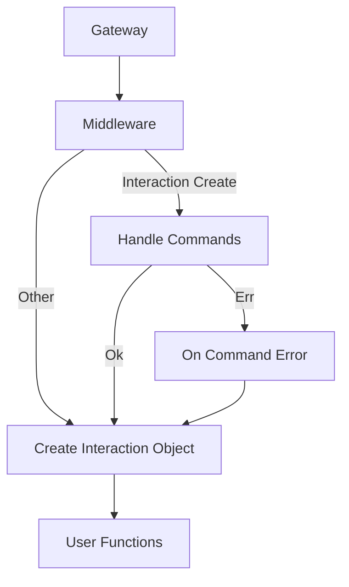

# Gateway

### Gateway
The gateway is where events from Discord are recieved. Sharding is not currently implemented in the lib but when it is, it will be mentioned in this section.
[Link](https://discord.com/developers/docs/topics/gateway).
### Middleware
Middleware is where gateway events are handled by the user. Most middleware in the lib just create an object to pass to the user functions.
### Handling Commands
The `interaction_create` middleware handles application commands and autocomplete.